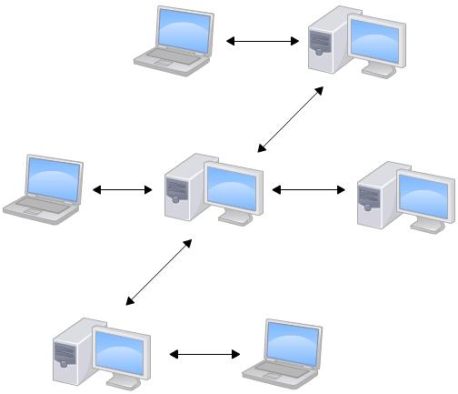
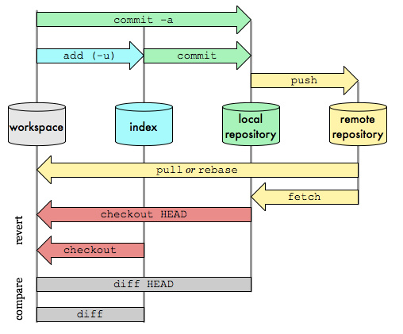
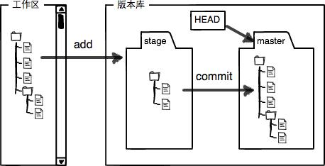

## 1.分布式和集中式版本控制
集中式：

- 版本库存放在中央服务器
- 中央服务器坏了大家都没法干活了
- 典型代表: svn

<!-- more -->

分布式：

- 每个人都有一份完整的版本库
- 也有中央服务器，但作用是交换大家的修改，没有大家一样能干活
- 典型代表: git

## 2.git的工作流
**一图胜千言：**


## 3.基本操作
**创建版本库（repository）：**
```bash
$ cd learn
$ git init
```
**添加文件、提交：**
```bash
$ git add file.txt
$ git commit -m "add file.txt"
```
**查看当前git状态：**
```bash
$ git status
```
**查看修改的内容：**
```bash
$ git diff file.txt
# 没有add之前
```

## 4.版本回退
**查看版本日志：**
```bash
$ git log
# 或
$ git log --pretty=oneline
3628164fb26d48395383f8f31179f24e0882e1e0 append GPL
ea34578d5496d7dd233c827ed32a8cd576c5ee85 add distributed
cb926e7ea50ad11b8f9e909c05226233bf755030 wrote a readme file
```
**回退到上一个版本：**
```bash
$ git reset --hard HEAD^
# HEAD是版本指针，表示当前版本，HEAD^表示上一个版本
```
**回退到指定版本：**
```bash
$ git reset --hard 362816
# 版本号没必要写全，只要没重复就行
```
**重返未来版本：**
```bash
$ git reflog
# 当你使用reset回退到了之前的版本，这时用git log已经看不到回退之前的版本了！
# 而用git reflog查看命令历史就可以看到
```

## 5.工作区和暂存区

- Git的版本库里存了很多东西，其中最重要的就是称为stage（或者叫index）的暂存区，还有Git为我们自动创建的第一个分支master，以及指向master的一个指针叫HEAD。
- git add后文件会放到暂存区，确认无误后commit提交到分支。

## 6.撤销修改
**第一种情况：修改了，但没有add到暂存区**
```bash
$ git checkout -- file.txt
```

**第二种情况：修改了，并且add到暂存区**
```bash
$ git reset HEAD file.txt
# 这时暂存区已经清除
$ git checkout -- file.txt
# 丢弃工作区的修改
```
**第三种情况：commit提交了**
见版本回退

## 7.删除文件
```bash
$ rm file.txt
$ git rm file.txt
$ git commit -m "remove file.txt"
```

如果删错，并且没有提交的话，可以这样恢复：
```bash
$ git checkout -- file.txt
```


