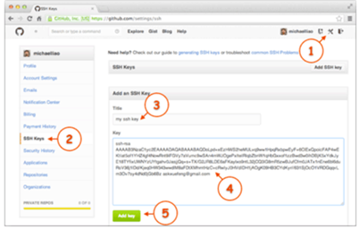

## 1.远程仓库-GitHub
GitHub是提供仓库托管服务的，现在我们把它作为我们的远程仓库。GitHub免费仓库是公开的，所有人都可以看到，所以如果不是开源项目，要么付费，要么自己搭建Git服务器。
 GitHub应用场景：你已经在本地创建了一个Git仓库后，又想在GitHub创建一个Git仓库，并且让这两个仓库进行远程同步，这样，GitHub上的仓库既可以作为备份，又可以让其他人通过该仓库来协作，真是一举多得。
<!-- more -->

## 2.添加远程仓库
(1)在GitHub中添加ssh公钥
**本地生成ssh key：**
```bash
$ ssh-keygen -t rsa -C "youremail@example.com"
# 在~/.ssh/目录下生成了id_rsa和id_rsa.pub密钥对，其中id_rsa.pub就是公钥
```
**将公钥上传到GitHub上：**


注意：
- 只有将ssh公钥上传到GitHub上，本地才能做推送、更新等操作，因为GitHub传输是通过ssh加密的。
- GitHub允许添加多个ssh公钥。你在哪办公，就要将本地的公钥上传上去，你才能对你的远程仓库进行操作。

(2)将本地的仓库与GibHub上的远程仓库关联
**进入到本地仓库的目录：**
```bash
$ cd shell
```
**将本地仓库和远程仓库关联起来：**
```bash
$ git remote add origin https://github.com/JasonNullx/shell.git
# 或如下方式
$ git remote add origin git@github.com: JasonNullx/shell.git
# origin为远程仓库的名字，这是git的默认叫法，可以改成别的，但建议不改！
```
**查看远程库的信息：**
```bash
$ git remote -v
```

## 3.推送
**把本地仓库的内容推送到GitHub（远程仓库）上的主分支master：**
```bash
$ git push -u origin master
#  加上了-u参数，Git不但会把本地的master分支内容推送的远程新的master分支，还会把本地的master分支和远程的master分支关联起来，在以后的推送或者拉取时就可以简化命令。简化命令如下所示：
$ git push origin master
```

## 4.从远程仓库更新
如果你在多个地方办公，比如家里和公司。那么你每次开始工作时，最好先从远程仓库更新，确保你的版本库是最新的。

**方法1：**
```bash
$ git fetch origin master
# 获取更新

$ git diff origin/master
# 比较
diff --git a/README.md b/README.md
index 2141b9d..d26dd17 100644
--- a/README.md
+++ b/README.md
@@ -1 +1 @@
-# 一些常用的python脚本
+# 常用的python脚本

$ git merge origin/master
# 比较完后没问题就进行合并
```
**方法2：**
```bash
$ git pull
# 相当于git fetch + git merge
```

## 5.从远程仓库克隆到本地
**如果你想从你的远程仓库完整的拷贝一份到本地，可以采用克隆的方式：**
```bash
$ git clone git@github.com:JasonNullx/gitskills.git
```

