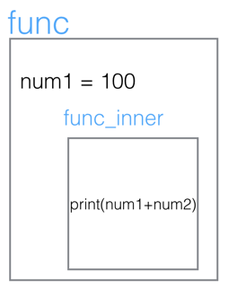

## 1.闭包的定义
内部函数对外部函数作用域里变量的引用（非全局变量），则称内部函数为闭包。闭包的特征有如下几点：
- 必须有一个内嵌函数
- 内嵌函数必须引用外部函数中的变量
- 外部函数的返回值必须是内嵌函数
<!-- more -->

```python
def func(num1):
    def func_inner(num2):
        print(num1+num2)
    return func_inner
# ret接收的是func_inner的引用
ret = func(100)
ret(1)
ret(100)
```
执行结果：
```
101
200
```

## 2.闭包的应用
### 例子1
```python
def line_conf(a, b):
    def line(x):
        return a*x + b
    return line

line1 = line_conf(1, 1)
line2 = line_conf(4, 5)
print(line1(5))
print(line2(5))
```
执行结果：
```
6
25
```
说明：
这个例子中，函数line与变量a,b构成闭包。在创建闭包的时候，我们通过line_conf的参数a,b说明了这两个变量的取值，这样，我们就确定了函数的最终形式(y = x + 1和y = 4x + 5)。我们只需要变换参数a,b，就可以获得不同的直线表达函数。由此，我们可以看到，闭包也具有提高代码可复用性的作用。
如果没有闭包，我们需要每次创建直线函数的时候同时说明a,b,x。这样，我们就需要更多的参数传递，也减少了代码的可移植性。

### 例子2
```python
# 统计hello函数调用了多少次
def hellocounter(func):
    count = 0 
    def inner():
        # 做自运算时，需要声明count变量是外部定义的，不然会报找不到该变量
        nonlocal count
        count += 1
        print("执行第%d次hello:" % count)
        func()
    return inner

def hello():
    print('Hello!')

# 此时传入的参数是一个函数引用，这其实就是装饰器的原型
hello = hellocounter(hello)
hello()
hello()
hello() 
```
执行结果：
```
执行第1次hello:
Hello!
执行第2次hello:
Hello!
执行第3次hello:
Hello!
```
## 3.思考
- 闭包可以有效减少函数所需传入的参数数目
- 利用闭包可以在不改变原函数的情况对函数进行功能扩展