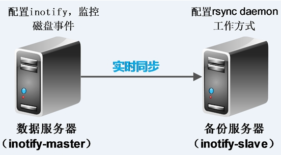

## 1. inotify介绍
   inotify是一种强大的、细粒度的、异步的文件系统事件控制机制。linux内核从2.6.13起，加入了inotify支持，通过inotify可以监控文件系统中添加、删除、修改、移动等各种事件，利用这个内核接口，第三方软件就可以监控文件系统下文件的各种变化情况，而inotify-tools正是实施监控的软件。
<!-- more -->
   随着应用系统规模的不断扩大，对数据的安全性和可靠性也提出的更好的要求，rsync在高端业务系统中也逐渐暴露出了很多不足，首先，rsync同步数据时，需要扫描所有文件后进行比对，进行差量传输。如果文件数量达到了百万甚至千万量级，扫描所有文件将是非常耗时的。而且正在发生变化的往往是其中很少的一部分，这是非常低效的方式。其次，rsync不能实时的去监测、同步数据，虽然它可以通过linux守护进程的方式进行触发同步，但是两次触发动作一定会有时间差，这样就导致了服务端和客户端数据可能出现不一致，无法在应用故障时完全的恢复数据。基于以上原因，rsync+inotify组合出现了！

## 2. rsync+inotify同步逻辑图

**注意：**
 - inotify-master为数据源，同时也是rsync客户端
 - 同步数据一般是从rsync客户端同步到服务器端

## 3. 环境部署
| 主机名        | 主机IP地址   |  系统版本        | 系统内核版本 |
| :--------:    | :--------:   |   :--------:      | :--------: |
| inotify-master| 192.168.1.128 | CentOS release 6.4 (Final) | 2.6.32-358.el6.x86_64 |
| inotify-slave | 192.168.1.160 | CentOS release 6.4 (Final) | 2.6.32-358.el6.x86_64 |

## 4. inotify-slave部署
这里就是部署rsync服务，rsync daemon工作模式。

### 4.1 检查是否安装rsync
``` bash
[root@inotify-slave ~]# rpm -qa rsync
rsync-3.0.6-9.el6.x86_64
```

### 4.2 新建rsync用户及模块目录并更改其用户组
``` bash
[root@inotify-slave mail]# useradd rsync -s /sbin/nologin  -M      #添加rsync用户

[root@inotify-slave mail]# grep rsync /etc/passwd
rsync:x:2004:2004::/home/rsync:/sbin/nologin

[root@inotify-slave mail]# mkdir /backup        #创建rsync daemon工作模式的模块目录

[root@inotify-slave mail]# ll -d /backup/
drwxr-xr-x. 2 root root 4096 4月  22 14:13 /backup/

[root@inotify-slave mail]# chown rsync.rsync /backup/   #更改模块目录的用户组

[root@inotify-slave mail]# ll -d /backup/
drwxr-xr-x. 2 rsync rsync 4096 4月  22 14:13 /backup/
```

### 4.3 编写rsync daemon配置文件/etc/rsyncd.conf
rsync需要手动创建rsync的配置文件/etc/rsyncd.conf，该配置文件分为两部分全局配置段和共享配置段，共享配置段可以有多个。

**具体配置如下：**
``` bash
[root@inotify-slave /]# cat /etc/rsyncd.conf
##rsyncd.conf start##
#工作中指定用户(需要指定用户)
uid = rsync
gid = rsync
#相当于黑洞.出错定位
use chroot = no
#有多少个客户端同时传文件
max connections = 200
#超时时间
timeout = 300
#进程号文件
pid file = /var/run/rsyncd.pid
#日志文件
lock file = /var/run/rsync.lock
#日志文件
log file = /var/log/rsyncd.log
#共享配置段，名称随便起
[backup]    
#需要同步的目录，也就是要同步的目标目录
path = /backup/
#表示出现错误忽略错误
ignore errors
#表示网络权限可写(本地控制真正可写)
read only = false
#这里设置IP或让不让同步
list = false
#指定允许的网段
hosts allow = 192.168.1.0/24
#拒绝链接的地址，一下表示没有拒绝的链接。
hosts deny = 0.0.0.0/32
#不要动的东西(默认情况)
#虚拟用户
auth users = rsync_backup
#虚拟用户的密码文件
secrets file = /etc/rsync.password
#配置文件的结尾
#rsync_config_______________end
```
### 4.4 配置虚拟用户的密码文件
``` bash
[root@inotify-slave /]# echo "rsync_backup:leesir" >/etc/rsync.password

[root@inotify-slave /]# cat /etc/rsync.password
rsync_backup:leesir   #注：rsync_backup为虚拟用户，leesir为这个虚拟用户的密码

[root@inotify-slave /]# chmod 600 /etc/rsync.password      #为密码文件提权，增加安全性

[root@inotify-slave /]# ll /etc/rsync.password
-rw-------. 1 root root 20 4月  22 14:20 /etc/rsync.password
```

### 4.5 启动rsync 服务
``` bash
[root@inotify-slave /]# rsync --daemon   #启动rsync服务

[root@inotify-slave /]# ps -ef |grep rsync
root     14871     1  0 14:24 ?        00:00:00 rsync --daemon
root     14873 14788  0 14:24 pts/0    00:00:00 grep rsync

[root@inotify-slave /]# netstat -lnutp |grep rsync
tcp        0      0 0.0.0.0:873                 0.0.0.0:*                   LISTEN      14871/rsync
tcp        0      0 :::873                      :::*                                LISTEN      14871/rsync
```

### 4.6 通过inotify-master测试推送
**inotify-master配置密码文件，测试推送:**
``` bash
[root@inotify-master ~]# echo "leesir" >/etc/rsync.password

[root@inotify-master ~]# cat /etc/rsync.password
leesir        #注意：这里只要写密码即可，切记。

[root@inotify-master ~]# chmod 600 /etc/rsync.password

[root@inotify-master ~]# ll /etc/rsync.password
-rw------- 1 root root 7 4月  22 14:32 /etc/rsync.password

[root@inotify-master ~]# echo "hello leesir">test.txt

[root@inotify-master ~]# cat test.txt
hello leesir

[root@inotify-master ~]# rsync -avz test.txt rsync_backup@192.168.1.160::backup --password-file=/etc/rsync.password
sending incremental file list
test.txt
sent 82 bytes  received 27 bytes  72.67 bytes/sec
total size is 13  speedup is 0.12

inotify-slave检查：
[root@inotify-slave /]# ll /backup/
总用量 4
-rw-r--r--. 1 rsync rsync 13 4月  22 14:34 test.txt
[root@inotify-slave /]# cat /backup/test.txt
hello leesir
```

## 5. inotify-master部署
**注意：**
 - inotify是rsync客户端安装和执行的
 - 企业场景压力测试200-300个同步限制，受网卡，磁盘，带宽等的制约。

### 5.1 查看当前系统是否支持inotify
``` bash
[root@inotify-master ~]# ll /proc/sys/fs/inotify/
总用量 0
-rw-r--r-- 1 root root 0 4月  22 14:56 max_queued_events
-rw-r--r-- 1 root root 0 4月  22 14:56 max_user_instances
-rw-r--r-- 1 root root 0 4月  22 14:56 max_user_watches
```
显示这三个文件则证明支持。
> 拓展：
 /proc/sys/fs/inotify/max_queued_evnets
表示调用inotify_init时分配给inotify instance中可排队的event的数目的最大值，超出这个值的事件被丢弃，但会触发IN_Q_OVERFLOW事件。
    /proc/sys/fs/inotify/max_user_instances
表示每一个real user ID可创建的inotify instatnces的数量上限。
    /proc/sys/fs/inotify/max_user_watches
表示每个inotify instatnces可监控的最大目录数量。如果监控的文件数目巨大，需要根据情况，适当增加此值的大小。
例如： echo 30000000 > /proc/sys/fs/inotify/max_user_watches

### 5.2 下载inotify源码包并编译安装
**源码安装inotify：**
``` bash
[root@inotify-master tools]# wget http://github.com/downloads/rvoicilas/inotify-tools/inotify-tools-3.14.tar.gz  #下载inotify源码包
..................................
root@inotify-master tools]# ll inotify-tools-3.14.tar.gz
-rw-r--r-- 1 root root 358772 3月  14 2010 inotify-tools-3.14.tar.gz

[root@inotify-master tools]# tar zxf inotify-tools-3.14.tar.gz

[root@inotify-master tools]# cd inotify-tools-3.14

[root@inotify-master inotify-tools-3.14]# ./configure --prefix=/usr/local/inotify-3.14 #配置inotify,并指定安装路径为/usr/local/inotify-3.14
................................
[root@inotify-master inotify-tools-3.14]# make && make install
```

### 5.3 inotify之inotifywait命令常用参数详解
**详解如下：**
``` bash
[root@inotify-master inotify-tools-3.14]# cd /usr/local/inotify-3.14/

[root@inotify-master inotify-3.14]# ./bin/inotifywait --help
-r|--recursive   Watch directories recursively. #递归查询目录
-q|--quiet      Print less (only print events). #打印监控事件的信息
-m|--monitor   Keep listening for events forever.  Without this option, inotifywait will exit after one  event is received.        #始终保持事件监听状态
--excludei <pattern>  Like --exclude but case insensitive.    #排除文件或目录时，不区分大小写。
--timefmt <fmt> strftime-compatible format string for use with %T in --format string. #指定时间输出的格式
--format <fmt>  Print using a specified printf-like format string; read the man page for more details.
#打印使用指定的输出类似格式字符串
-e|--event <event1> [ -e|--event <event2> ... ] Listen for specific event(s).  If omitted, all events are  listened for.   #通过此参数可以指定需要监控的事件，如下所示:
Events：
access           file or directory contents were read       #文件或目录被读取。
modify           file or directory contents were written    #文件或目录内容被修改。
attrib            file or directory attributes changed      #文件或目录属性被改变。
close            file or directory closed, regardless of read/write mode    #文件或目录封闭，无论读/写模式。
open            file or directory opened                    #文件或目录被打开。
moved_to        file or directory moved to watched directory    #文件或目录被移动至另外一个目录。
move            file or directory moved to or from watched directory    #文件或目录被移动另一个目录或从另一个目录移动至当前目录。
create           file or directory created within watched directory     #文件或目录被创建在当前目录
delete           file or directory deleted within watched directory     #文件或目录被删除
unmount         file system containing file or directory unmounted  #文件系统被卸载
```

### 5.4 编写监控脚本并加载到后台执行
**shell脚本如下：**
``` bash
#!/bin/bash
#para
host01=192.168.1.160  #inotify-slave的ip地址
src=/backup/        #本地监控的目录
dst=backup         #inotify-slave的rsync服务的模块名
user=rsync_backup      #inotify-slave的rsync服务的虚拟用户
rsync_passfile=/etc/rsync.password   #本地调用rsync服务的密码文件
inotify_home=/usr/local/inotify-3.14    #inotify的安装目录
#judge
if [ ! -e "$src" ] \
|| [ ! -e "${rsync_passfile}" ] \
|| [ ! -e "${inotify_home}/bin/inotifywait" ] \
|| [ ! -e "/usr/bin/rsync" ];
then
echo "Check File and Folder"
exit 9
fi
${inotify_home}/bin/inotifywait -mrq --timefmt '%d/%m/%y %H:%M' --format '%T %w%f' -e close_write,delete,create,attrib $src \
| while read file
do
#  rsync -avzP --delete --timeout=100 --password-file=${rsync_passfile} $src $user@$host01::$dst >/dev/null 2>&1
cd $src && rsync -aruz -R --delete ./  --timeout=100 $user@$host01::$dst --password-file=${rsync_passfile} >/dev/null 2>&1
done
exit 0
```
```shell
[root@inotify-master scripts]# sh inotify.sh &       #将脚本加入后台执行
[1] 13438
```

### 5.5 实时同步测试
**inotify-master操作：**
``` bash
[root@inotify-master scripts]# cd /backup/
[root@inotify-master backup]# ll
总用量 0
[root@inotify-master backup]# for a in `seq 200`;do touch $a;done  #创建200个文件
[root@inotify-master backup]# ll  --time-style=full-iso
总用量 0
-rw-r--r-- 1 root root 0 2014-04-22 15:34:08.141497569 +0800 1
-rw-r--r-- 1 root root 0 2014-04-22 15:34:08.172497529 +0800 10
-rw-r--r-- 1 root root 0 2014-04-22 15:34:08.235497529 +0800 100
-rw-r--r-- 1 root root 0 2014-04-22 15:34:08.236497529 +0800 101
-rw-r--r-- 1 root root 0 2014-04-22 15:34:08.237497529 +0800 102
...................................
```

**inotify-slave检查：**
``` bash
[root@inotify-slave backup]# ll  --time-style=full-iso
总用量 0
-rw-r--r--. 1 rsync rsync 0 2014-04-22 15:34:08.393823754 +0800 1
-rw-r--r--. 1 rsync rsync 0 2014-04-22 15:34:08.393823754 +0800 10
-rw-r--r--. 1 rsync rsync 0 2014-04-22 15:34:08.393823754 +0800 100
-rw-r--r--. 1 rsync rsync 0 2014-04-22 15:34:08.393823754 +0800 101
-rw-r--r--. 1 rsync rsync 0 2014-04-22 15:34:08.393823754 +0800 102
..........................
```
